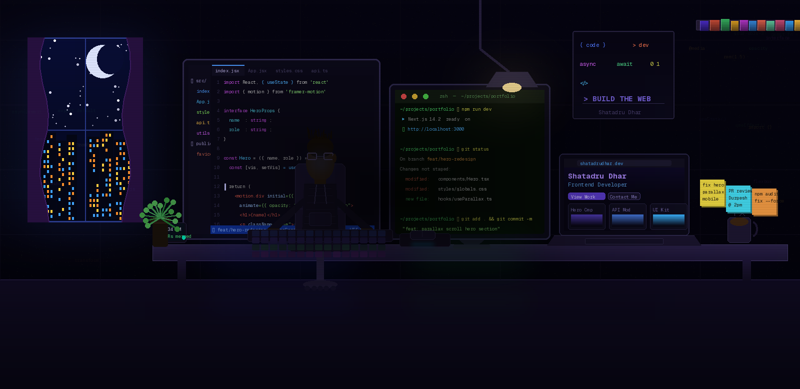

<div align="center">
<br/>
<!-- ANIMATED BANNER -->




<br/>

<!-- SOCIAL BADGES -->
[](https://www.linkedin.com/in/shatadru-dhar/)
[](https://github.com/ShatadruDhar)
[](mailto:shatadrudhar10c@gmail.com)
[](https://github.com/ShatadruDhar)

</div>

---

<br/>

##  &nbsp; About Me

```typescript
const shatadru: Developer = {
  name:       "Shatadru Dhar",
  role:       "Frontend Developer & AI Engineer",
  location:   "Hooghly, West Bengal, India 🇮🇳",
  education:  "B.Tech Information Technology @ KGEC",
  passion:    ["Clean UI", "AI Solutions", "Open Source"],

  currentlyWorking: "Building pixel-perfect web experiences",
  currentlyLearning: ["Advanced React Patterns", "WebGL", "Next.js"],

  funFact: "I turn coffee ☕ into clean, accessible code.",
};
```
<br/>

##  &nbsp; Tech Arsenal

<div align="center">

### 🎨 Frontend


### 🤖 AI / ML


### 🛠️ Tools & Languages


</div>

---


## 🚀 Featured Projects

<div align="center">

| Project | Description | Stack |
|:-------:|:-----------:|:-----:|
| 🎯 **[Poke Summarizer](https://github.com/coder-royswarnajit/Poke-Summarizer)** | Multi-modal AI that summarizes text, video & audio with sentiment analysis | Python · Streamlit · Whisper · Groq API |
| 🛠️ **[Tekshila](https://github.com/ShatadruDhar/Tekshila)** | AI-powered code assistant — auto-generates READMEs, comments & PRs | JS · HTML · CSS · Gemini API · GitHub API |
| 🛰️ **Satellite Image Analyzer** | AI-powered satellite imagery analysis for environmental monitoring | Python · Computer Vision · ML |
| 💼 **[PromptHire](https://github.com/Durgeshwar-AI/PromptHire)** | AI-driven hiring platform with prompt-based workflows | TypeScript |

</div>

---

## 📊 GitHub Stats

<div align="center">


</div>

<div align="center">


</div>

---

## 🗺️ Activity Graph

<div align="center">


</div>

---

## 🏆 Achievements

<div align="center">


</div>

```
🥇  HackHazards — Top 100 teams out of 8,500+   (TheNameSpaceCommunity)
📐  JEE MAINS 2023 — Ranked 34,000
📊  WBJEE 2023 — Ranked 2,722
🌐  OSCI #6 — Open Source Contributor
🎓  Class XII — 88.5%  |  Class X — 87.66%
```

---

## 🌐 Connect With Me

<div align="center">

<a href="https://www.linkedin.com/in/shatadru-dhar/" target="_blank">
  
</a>
&nbsp;
<a href="https://github.com/ShatadruDhar" target="_blank">
  
</a>
&nbsp;
<a href="mailto:shatadrudhar10c@gmail.com">
  
</a>

<br/><br/>


<br/>


</div>
